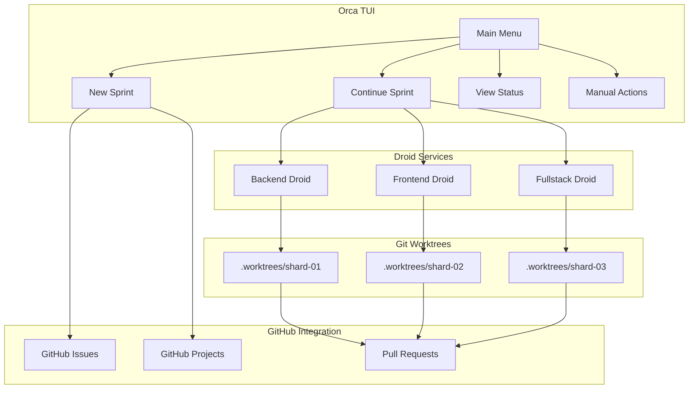
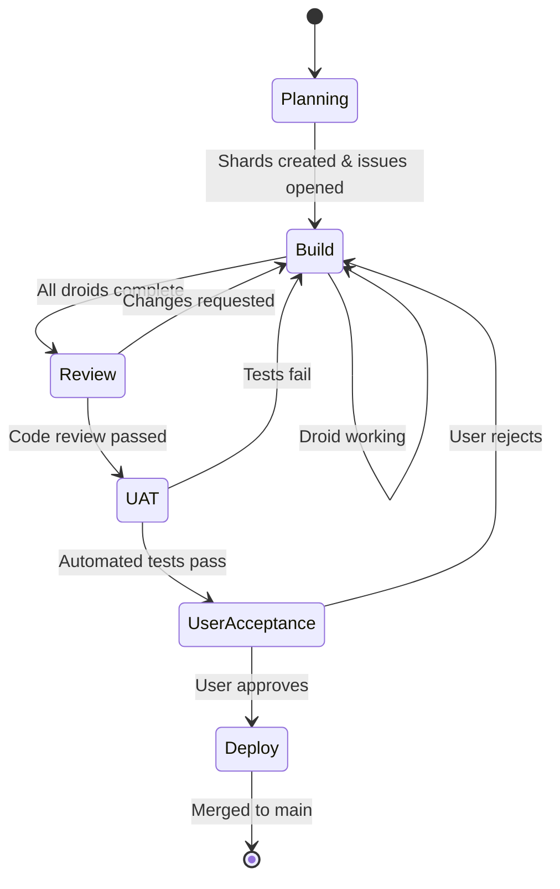
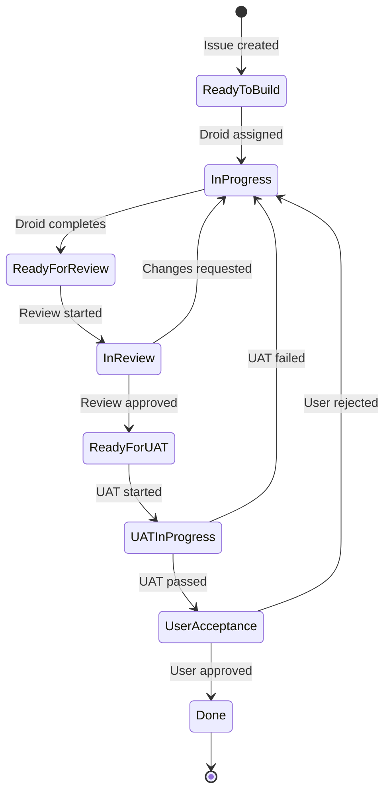
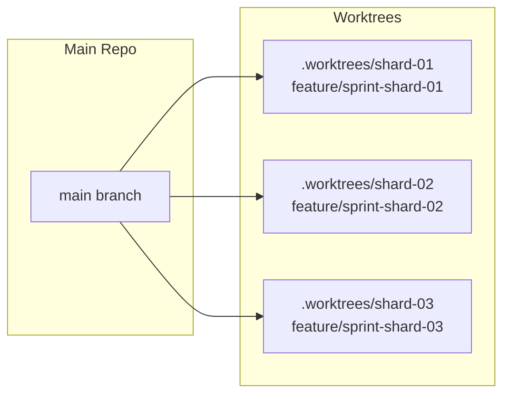
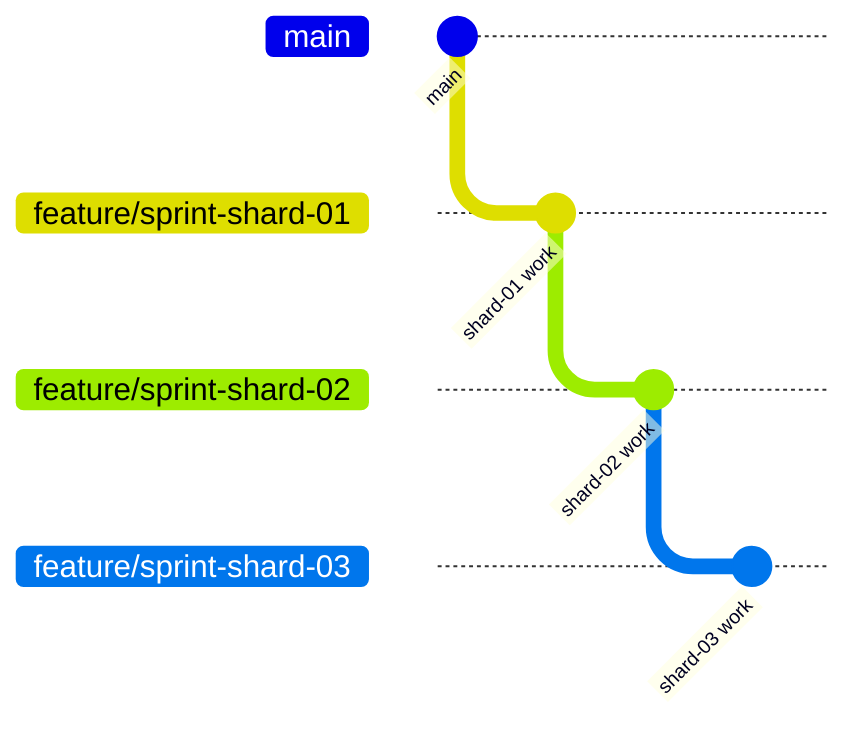

# Orca-Strata

A menu-driven TUI orchestrator that coordinates AI-powered development workflows. Orca handles **planning and execution control** while delegating actual coding work to [Factory Droid](https://github.com/factory-ai/droid) - the AI coding agent.

## Why Orca?

Building complex applications with AI agents is powerful—but chaotic. Without coordination:
- **Agents step on each other's work**, causing merge conflicts and lost progress
- **Context gets lost** between sessions, forcing repeated explanations
- **No visibility** into what agents are doing or how far along they are

Orca solves this by treating AI development as a **managed workflow**.

### The Core Insight

> AI works best with well-defined, isolated tasks.

Orca breaks features into **shards**—small, focused units of work with clear boundaries. Each shard runs in its own git worktree, with its own branch, assigned to a specialized droid. This isolation provides **guardrails** that keep agents focused on their task without drifting into unrelated code.

### Why Droids as Services?

Rather than one-shot CLI commands, Orca invokes droids as background services:
- **Persistent context** across tasks within a sprint
- **Parallel execution** across multiple shards simultaneously  
- **Better monitoring** with real-time progress visibility

### Model-Agnostic Orchestration

Orca is a **model-agnostic orchestration layer**. Different shards can use different models based on task complexity. Swap models without changing your workflow.

### Who Is This For?

Anyone building complex applications and features that require **managed agentic development processes**. Whether you're a solo developer multiplying your output or a team coordinating AI-assisted workflows, Orca provides the structure to ship faster without the chaos.

## How It Works

Orca is a **controller**, not a coding agent. It:

1. **Plans work** - Breaks features into shards with dependencies
2. **Manages isolation** - Creates git worktrees for parallel droid work
3. **Invokes droids** - Calls `droid exec` with shard context and constraints
4. **Tracks progress** - Monitors completion, handles failures, manages state
5. **Orchestrates merges** - Uses Graphite-style branch stacking for clean history

```
┌─────────────────────────────────────────────────────────┐
│                      ORCA (TUI)                         │
│  Planning • Worktrees • Progress • Merge • Deploy       │
└─────────────────────────────────────────────────────────┘
                           │
                           │ droid exec --auto <level>
                           ▼
┌─────────────────────────────────────────────────────────┐
│                   FACTORY DROID                         │
│  Code Generation • File Editing • Git Commits           │
└─────────────────────────────────────────────────────────┘
```

## Prerequisites

- [Factory Droid CLI](https://docs.factory.ai) installed and configured
- Git 2.20+ (for worktree support)
- Bun runtime

## Installation

```bash
git clone https://github.com/Holovkat/orca-strata.git
cd orca-strata
bun install
bun run build
npm link
```

## Usage

```bash
orca
```

## Architecture Overview



## Workflow Phases



### Phase Details

| Phase | Description | Exit Criteria |
|-------|-------------|---------------|
| **Planning** | Gather requirements, break into shards, create GitHub issues | All shards defined with issues |
| **Build** | Assign droids to shards in isolated worktrees | All shards complete |
| **Review** | Code review, lint, typecheck, build verification | All checks pass |
| **UAT** | Automated browser testing | Tests pass |
| **User Acceptance** | Manual user verification | User approves |
| **Deploy** | Merge shards, push, cleanup | Merged to main |

## Shard Lifecycle



## Project Structure

```
your-project/
├── .orchestrator.yaml      # Orca configuration
├── features/
│   └── sprint-name/
│       ├── prd.md                    # Product requirements
│       ├── shard-00-architecture.md  # Architecture shard (always first)
│       ├── shard-01-*.md             # Implementation shards
│       ├── shard-02-*.md
│       └── sprint-state.json         # Sprint state tracking
├── .worktrees/                       # Isolated droid workspaces
│   ├── sprint-name-shard-01/
│   ├── sprint-name-shard-02/
│   └── sprint-name-shard-03/
└── src/                              # Your source code
```

## Git Worktrees

Orca uses git worktrees to provide isolated environments for each droid:



**Benefits:**
- Droids work in parallel without conflicts
- Each shard has its own branch
- Changes are isolated until review
- Easy cleanup after sprint completion

## Graphite-Style Branch Stacking

Branches are stacked sequentially, not all from main:



This allows:
- Dependent shards to build on previous work
- Clean rebase operations
- Sequential PR merging

## Droid Integration

Orca uses Factory Droid's stock CLI - no custom agents or plugins required.

### How Droids Are Invoked

When a shard is ready to build, Orca:

```bash
droid exec --auto high --model claude-sonnet-4-5-20250929 \
  --cwd /path/to/worktree \
  "Implement shard: <title>. Read shard file for requirements..."
```

The `--auto` level controls how much autonomy the droid has:
- `low` - Asks before most actions
- `medium` - Asks before destructive actions
- `high` - Fully autonomous (recommended for isolated worktrees)

### Shard Context

Each droid receives:
- Shard file path with requirements and acceptance criteria
- Isolated worktree directory to work in
- Model override (per-shard or from config)
- Instructions to commit when complete

### Droid Assignment

Droids are assigned based on shard type:

| Shard Type | Assigned Droid |
|------------|----------------|
| `backend` | senior-backend-engineer |
| `frontend` | frontend-developer |
| `fullstack` | fullstack-developer |
| `docs` | documentation-specialist |

### Output Streaming

Droid output streams to the TUI in real-time. You can:
- Watch progress as the droid works
- Press `Esc` to minimize and continue working
- View running droids from the menu

## GitHub Integration

### Issues

Each shard becomes a GitHub issue with:
- Title from shard name
- Body from shard spec
- Labels: `shard`, `sprint:<name>`, `type:<backend|frontend|fullstack>`
- Linked to sprint epic issue

### Project Boards

Orca creates/uses GitHub Projects (Kanban) with columns:

```
Ready to Build → In Progress → Ready for Review → In Review → Ready for UAT → UAT in Progress → User Acceptance → Done
```

Issue cards move automatically as shard status changes.

## Configuration

Create `.orchestrator.yaml` in your project root:

```yaml
project_name: "My Project"
repo: "owner/repo"

tracking:
  mode: "github"           # github | local | both
  backlog_board: "Backlog"

paths:
  features: "features/"
  docs: "docs/design/"
  worktrees: ".worktrees/"

droids:
  model: "claude-sonnet-4-5-20250929"
  auto_level: "medium"     # low | medium | high

app_url: "http://localhost:3000"

branching:
  pattern: "feature/{sprint}-{shard}"
  stack_from: "previous"   # previous | main
```

## Development

```bash
bun run dev          # Run in development
bun run build        # Build for distribution
bun run typecheck    # Type check
```

## Tech Stack

- **Runtime**: Bun
- **UI**: Ink (React for terminal) + React 19
- **Language**: TypeScript
- **CLI**: Commander
- **VCS**: Git with worktrees
- **Tracking**: GitHub Issues & Projects

## License

MIT
